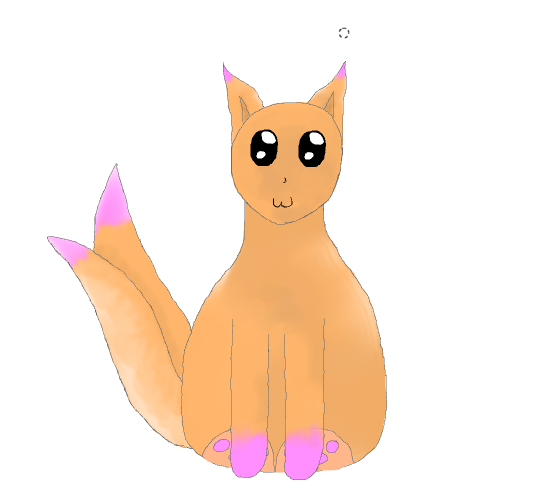

# TAGEBUCH

### 23.07.2016  ~6 Stunden

- GITHub soll als Code- und Versionsverwaltungstool verwendet werden, da man den Quellcode sehr einfach Serverseitig speichern und überall abrufen kann. 

- Erstellung von GITHub Accounts.

- Als IDE soll Eclipse Neon verwendet werden, Gründe hierfür sind unter anderem die Kompatibilität mit GITHub.

- Als Grafische Oberfläche wird die von Java bereitgestellte Library "Swing" verwendet. 

- Für das Zeichnen von Klassendiagrammen verwenden wir das Tool "Dia".

- Anfängliches Einarbeiten in die Java GUI.

- Anfängliches Klassendiagramm angefertigt.

  
_Aufgetretene Probleme:_
-> Vererbungen der Abstrakten Nahrungsklasse konnten nicht richtig gelöst werden.
-> Abfrage ob ein Objekt eine Instanz einer bestimmten Klasse ist.

----------------

### 15.09.2016 ~1 Stunde

 Erstellung des genannten Zeitplans für die Fertigung des Tamagotchis.

----------------

### 27.09.2016 ~2 Stunden

Gemeinsames Einarbeiten in die Java GUI mit einem Übungstutorial: http://www.programmierenlernenhq.de/java-spiel-programmieren-tutorial/

---------------

### 27.09.2016 ~1.5 Stunden

GITHub Tagebuch und Zeitplanverwaltung angelegt, dazu gehörte das Einlesen in besondere _"Marker"_ in .md Dateien auf GitHub.
Beispielsweise kann mit Hashtags eine Überschrift gestaltet werden, dabei unterscheidet man zwischen h1 bis h6 (Je höher die Zahl hinter dem "h", desto kleiner die Überschrift).

-----------------

### 28.09.2016 ~30 Minuten

Grammatikalische Korrekturen und Ergänzungen zum Tagebuch und zum Zeitplan.

--------------------

### 01.10.2016 ~10 Minuten

Zeitplan wurde aus dem Tagebuch entfernt, da es dort als unpassend empfunden wurde. Stattdessen ist es nun in der Milestones Abteilung, welche von GITHub bereitgestellt wird. Zu finden sind diese unter: _"Issues -> Milestones"_

-----------------

### 04.10.2016 ~2 Stunden

Angefangen den Prototyp des Klassendiagramms zu zeichnen. Einführung in den "ScheduledThreadPoolExecutor" um einen parallelen Task ein oder mehrfach ausführen zu lassen. 
Für das nächste Treffen war die fertigstellung des Klassendiagramms geplant.

---------------

### 06.10.2016 ~30 Minuten 

Fertigstellung des Klassendiagramms für den Prototyps des Tamagotchis.

----------------

### 11.10.2016

#### ~2 Stunden
Struktur der Klassen "Tamagotchi", "Nahrung" und "Bedürfnisse" durchgesprochen und anfänglich Programmiert. Die jeweiligen Klassen wurden aufgeteilt und jeder von uns 3 hat jeweils ein Package bearbeitet. Einführung in GitHub Desktop (Einrichten des lokalen Repositories, Commits, Pull Requests und merging). 

#### ~1 Stunde
Probleme mit dem GitHub Repository behoben, welche darauf zurückzuführen sind, dass ein ganzes Eclipse Workspace im Repository eingeklinkt war (Siehe Issues).
Programmierung der Nahrungsklassen für den Anfänglichen Tamagotchi Milestone.

#### ~30 Minuten
Die Bedürfnisklassen für den Milestone "Anfängliches Tamagotchi" programmiert.

------------

### 12.10.2016 ~1 Stunde

Zusammenführung aller Klassen, die bis jetzt für das Projekt programmiert wurden. Somit ist die Konsolen Version des Anfänglichen Tamagotchis vollendet und somit auch der ***der erste Milestone*** abgeschlossen. Der nächste Schritt wird sein, eine GUI ohne großen Design Aufwand für den jetzigen Stand zu programmieren.

-------------

### 18.10.2016 ~2 Stunden

Überlegung, wie wir die GUI handhaben wollen. Wir einigten uns nun darauf, die Buttons nicht in das Zeichenfenster zu integrieren, sondern eine zweites "Button Fenster" neben der Zeichenfläche zu erstellen.

Anfängliche GUI erstellt, welche die funktionalitäten der Klassen darstellen soll.

---------------

### 25.10.2016 ~2 Stunden

Fertigstellung des Meilensteins "Bedürfniss Balken", welche die Bedürfnisse Grafisch mit Balken anzeigen, je mehr Hunger das Tamagotchi hat, desto kleiner wird der Balken.
Zusätzlich Gespräch mit Maier Andre über Speicherung des Spielstands, in dem man ein komplettes Objekt in ein File schreibt und dies beim Spielstart wieder ausliest. Ausserdem hatte er die XOR-Verschlüsselung angesprochen um das beschriebene File zu verschlüsseln, damit keiner unberechtigten Zugriff darauf haben kann. 
Tipp: Klassendiagramm von einem Eclipse-Plugin erstellen lassen.

-------------

### 08.11.2016 ~4 Stunden

Versucht Speicherung des Spielstandes zu implementieren anhand der Java Objektserialisierung. Mehrere Testversuche an kleineren Programmen, allerdings ~3 Stunden ohne Erfolg. Beim Ausleseversuch gibt es eine EOFException. Wir vermuten einen Fehler bei der Angabe des Dokumentpfades. Siehe Issues "Speichern und Auslesen".
Mit Hilfe von Andre Maier Fehler gefunden. Im File wurde "null" gespeichert, da das Testspiel erst nach dem Listener instanziert wurde (5Byte großes File).
Idee: Für das ganze Tamagotchi einen Debugmode einbinden mit einem Konstanten Interface, den man dann an- und ausschalten kann.

----------

### 24.11.2016

Da die Projektarbeitstunde in dieser Woche und in der kommenden Woche aus(ge)fallen sind/werden wird das nächste Treffen am 
Samstag den 26.11.2016 stattfinden. Dabei wird die nächste Arbeitsteilung besprochen. Zusätzlich ist geplant die Serialisierbarkeit zu bewerkstelligen, um eine Speicher- und Ladefunktion einzubauen.

--------------------

### 26.11.2016 ~5 Stunden

Die Aufgabenverteilung wurde festgelegt:

<strong>Marleen</strong> wird sich um das GUI Design kümmern, dazu gehören unter anderem Animationen für das Tamagotchi und Hintergründe bzw. das Designen des Fensters. Ausserdem wird sie sich um die Implementierung eines Debug-Modus kümmern, welcher mit globalen Variablen auf verschiedene Stufen gesetzt werden kann. Dies soll dazu führen die Fehlerbehebung im späteren Verlauf deutlich zu vereinfachen.

<strong>Joshua</strong> und <strong>Marius</strong> werden zusammen an den Funktionen des Tamagotchis weiterarbeiten. Der erste Schritt wwerden sein: Die Bedürfnissstruktur durch neue Bedürfnisse, einer Zeitstruktur für diese und ein Interaktionssystem zwischen den Bedürfnissen, welches das Tamagotchi "realer" erscheinen lassen könnten.

Desweiteren wurde das Problem mit der Serialisierbarkeit und dem damit nicht möglichem Speichern und Abrufen eines Spielstandes behoben.
Es war nötig Statische Variablen in allen Klassen, welche mit dem Tamagotchi zusammen in einer Datei namens "Save.ser" gespeichert wurden, zu entfernen und durch non-static Variablen zu ersetzen.

Mit dem Eclipse-Plugin wurde ein UML-Klassendiagramm generiert, welches durch das simple Anwählen des Sourcecodes Relationen zwischen Klassen herstellt. Dieses Klassendiagramm ist im Repository unter dem Namen "UML_Activity_Diagramm.png" einzusehen.

----------------------------------------------------------------------

### 11.12.2016 ~2 Stunden 

Einführung von einer Game Over Funktion und Zentralisierung der Timer mit einer eigenen Klasse.

-----------------------------------------------------------------

### 17.12.2016

Die Bedürfnisse Schlafen und Spielen wurden grundlegend kreiert. Diese können noch nicht mit den anderen Bedürfnissen Interagieren, zusätzlich muss die Game Over Funktion dahingehend erweitert werden.

--------------------------------------------------

### 05.01.2017

Game Over Funktion wurde fertiggestellt, zusätzlich wurde eine New Game Funktion erstellt, welche über das Menü aufgerufen werden kann. Einige Änderungen am Internen Code wurde vorgenommen, um die Erweiterbarkeit zu verbessern. 

----------------------------------------------

### 06.01.2017

Die Bedürfnisse Spielen und Schlafen wurden in die Spielmechanik eingebracht und können graphisch eingesehen werden. Buttons wurden eingefügt, mit welchen die neuen Bedürfnisse bedient werden können. Für die weiteren Schritte müssen nurnoch die Bedürfnisse untereinander Interagieren und die Zeitstrukturen so angepasst werden, dass es sich spielbarer anfühlt. 

------------------------------------------------

### 26.11.2016 - 17.01.2017

Animations-Klasse (AnimationT) wurde eingebaut mit momentan noch Platzhalterbildern. Dabei wurden auch einige andere Klassen verändert, was das Zusammenführen mit den anderen neuen Klassen kompliziert macht.
Vom Tamagotchi wurden einige Entwürfe skizziert. Einigung auf einen zweischwänzigen, katzenartigen Entwurf.
Von diesem Tamagotchi wurde in GIMP mithilfe eines Graphic Tablets (von wacom) das Standartbild erstellt (Fertigstellung am 17.01.2017).
Problem momentan: AnimationT kann nicht auf den master branch commited werden, da die anderen Klassen in einer zu alte Version sind.
Interface Debugable mit Debug booleans wurde erstellt und wird im Laufe des Projekts mit eingebunden werden (hat schon ein bisschen Verwendung gefunden).
Stunden wurden nicht gezählt... :D

-----------------------------------------------

###02.03.2017 ~6 Stunden

Der Background wurde gezeichnet und eingefügt. 
In der AnimationT gibt es jetzt einen ImageIconArray, damit das Einlesen von den Bildern vereinfacht wird. 
Der Bilderwechsel hat eine andere Funktionalität um das Wechseln zwischen mehr als zwei Bildern zu ermöglichen ohne komische Zuckungen Seitens der Darstellung. Im Gamepanel wird nun auch der LoadStatus des anzuzeigenden Bildes überprüft um möglichen Wacklern auszuweichen. 
Für die Bedürfnisse Schlafen und Spielen wurden Icons gezeichnet und eingebaut. 
Die Darstellung wurde an den Hintergrund angepasst. Oben rechts wird nun auch der Name des Tamagotchis angezeigt.

--------------------------------------------

###02.03.2017

Die Spiellogik war bis jetzt fest mit der GUI verankert und dadurch nur in unserem Haupt-JFrame vorzufinden, dadurch mussten auch viele Werte doppelt und dreifach übergeben werden. Mit einer neuen Änderug wurde dies größtenteils behoben, da nun die Spiellogik in einer eigenen Klasse ist, von der man Attribute abfragen oder bestimmte Ereignisse (z.B. Game Over) durch einzelne Methoden auslösen kann.

Der nächste Große Punkt ist die Skalierbarkeit des Bildschirms, beim Start des Spiels wird nun abgefragt, welche Aufösung der User den gerne hätte. Dementsprechend werden auch GUI Elemente auf diese Größe angepasst. Das Ändern der Auflösung während des Spiels ist allerdings weiterhin nicht gewährleistet.

---------------------------------------------

###03.03.2017

Animation wurde an die verschiedenen Auflösungen angepasst.
X- und Y-Startwert der Bilder ist momentan mit einem Switch case festgelegt, weil mir kein Algorithmus der passt eingefallen ist...
